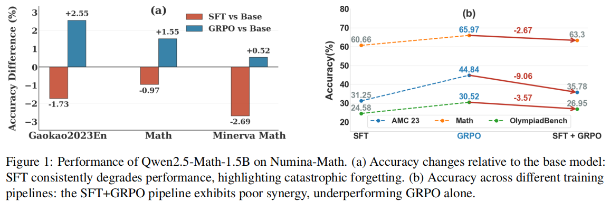
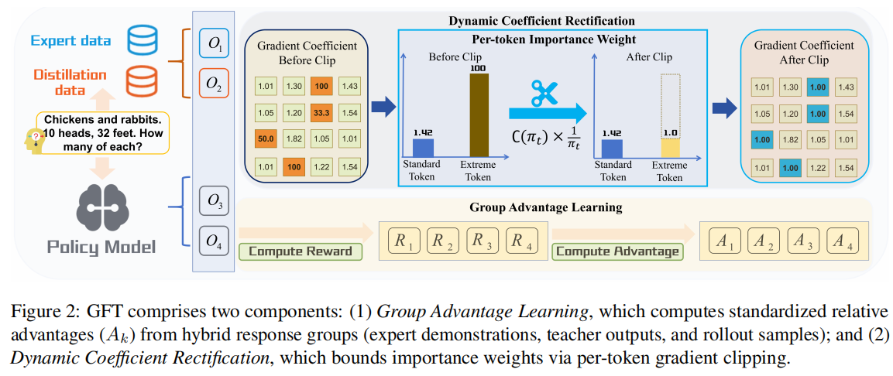
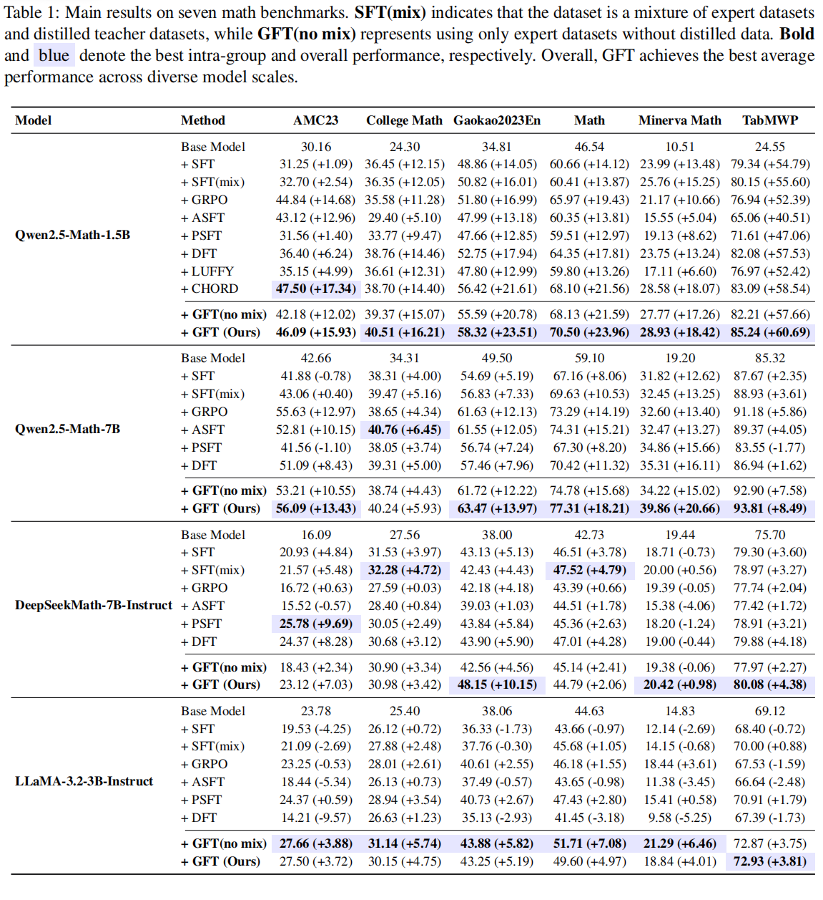
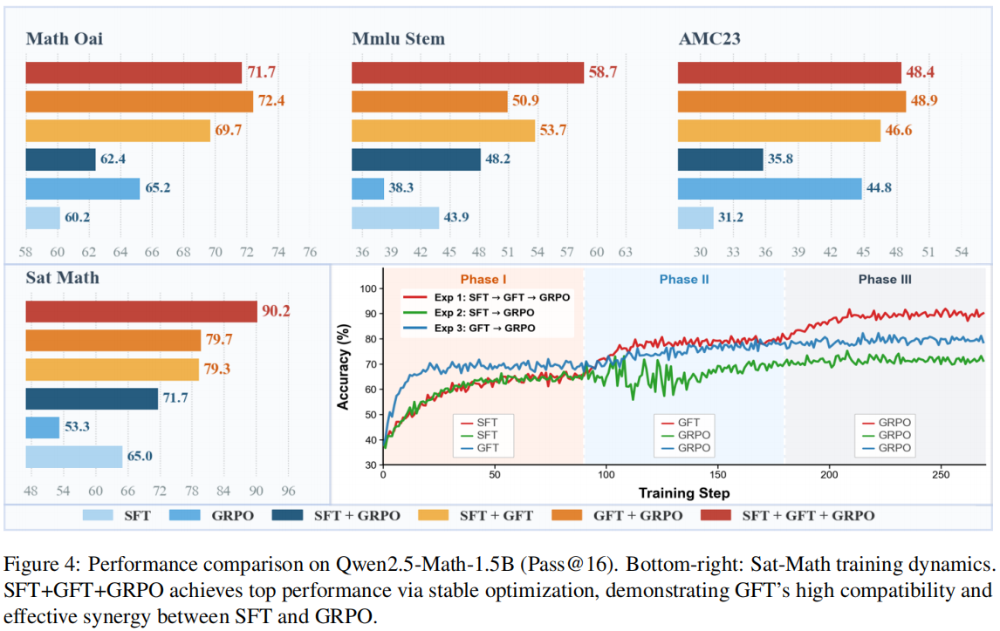

<h1 align="center"> GFT: Group Fine-Tuning </h1>
GFT: From Imitation to Reward Fine-Tuning with Unbiased Group Advantages and Dynamic Coefficient Rectification

<div align="center">

[[📖 Paper](https://arxiv.org/abs/2604.14258)] [[🤗 NuminaMath-Cot-Distillation-10W]()]

</div>

## 🔥 News
- [2025/04/06] Our work is accepted by ACL 2026 Findings.🎇🎇🎇

## 👀 Introduction
Large language models (LLMs) rely heavily on Supervised Fine-Tuning (SFT) and Reinforcement Learning (RL). However, standard SFT suffers from two critical flaws when viewed from a training-dynamics perspective:
1. **Single-path dependency:** Implicit reward strictly forces imitation, causing entropy collapse.
2. **Gradient explosion:** Unstable inverse-probability weighting leads to mechanical memorization and catastrophic forgetting.
**Group Fine-Tuning (GFT)** is a unified single-stage post-training framework designed to bridge the gap between efficient knowledge injection and robust exploration. GFT mitigates the intrinsic deficiencies of SFT and serves as an optimal initialization for downstream RL (like GRPO or PPO).


## 🧠 Method
* **Group Advantage Learning (GAL):** Constructs a diverse response group $\mathcal{G}_x$ (Expert + Teacher Distillation + Self-Sampled) and evaluates candidates via normalized contrastive supervision.
* **Dynamic Coefficient Rectification (DCR):** Adaptively bounds inverse-probability weights $1/\pi_{\theta}(y|x)$ to stabilize optimization without losing the capability to inject new knowledge.


## 🏆 Performance
* **Exceptional Data Efficiency:** With only **10k** training samples, GFT surpasses standard SFT trained on **100k** samples across multiple math-reasoning benchmarks (AMC23, MATH, OlympiadBench, etc.).
* **Solving the Synergy Dilemma:** Conventional `SFT -> GRPO` pipelines often underperform. GFT preserves policy entropy and diverse reasoning paths, making the `SFT -> GFT -> GRPO` pipeline yield a significantly higher performance ceiling.



## ⚙️ Set up
### 0. Environment
```bash
git https://github.com/ZJU-OmniAI/GFT.git
cd GFT

conda create -n DFT python=3.10 -y
conda activate DFT
cd verl
bash scripts/install_vllm_sglang_mcore.sh
pip install --no-deps -e .
```

### 2. Train
```bash
#!/bin/bash
set -x

project_name=GFT # Project name
experiment_name="qwen-math-1.5B-GFT" # Experiment name
train_path="" # Path to the training data
test_path="" # Path to the test data
train_batch_size=128 # Batch size
data_max_prompt_length=1024 # Maximum prompt length
data_max_response_length=2048 # Maximum response length
n_gpus_per_node=4
vllm_tensor_model_parallel_size=4

gft_loss_tao=0.1 # Threshold for gradient clipping
model_path="" # Path to the base model for training
data_teacher_count=4 # Number of off-policy data samples during training
data_student_count=4 # Number of on-policy rollout samples during training
micro_batch_size_per_gpu=16
gpu_memory_utilization=0.4
save_path="" # Path to save checkpoints


train_files="['$train_path']"
test_files="['$test_path']"

CUDA_VISIBLE_DEVICES=0,1,2,3 python -m verl.trainer.main_ppo \
    algorithm.adv_estimator=grpo \
    data.train_files="$train_files" \
    data.val_files="$test_files" \
    data.reward_fn_key="source" \
    data.train_batch_size=$train_batch_size \
    data.max_prompt_length=$data_max_prompt_length \
    data.max_response_length=$data_max_response_length \
    data.filter_overlong_prompts=True \
    data.truncation='error' \
    +data.teacher_count=$data_teacher_count \
    actor_rollout_ref.model.path=$model_path \
    actor_rollout_ref.actor.optim.lr=1e-6 \
    actor_rollout_ref.model.use_remove_padding=True \
    actor_rollout_ref.actor.ppo_mini_batch_size=64 \
    actor_rollout_ref.actor.ppo_micro_batch_size_per_gpu=$micro_batch_size_per_gpu \
    actor_rollout_ref.actor.use_kl_loss=False \
    actor_rollout_ref.actor.kl_loss_coef=0.001 \
    actor_rollout_ref.actor.kl_loss_type=low_var_kl \
    actor_rollout_ref.actor.entropy_coeff=0 \
    actor_rollout_ref.model.enable_gradient_checkpointing=True \
    actor_rollout_ref.actor.fsdp_config.param_offload=False \
    actor_rollout_ref.actor.fsdp_config.optimizer_offload=False \
    actor_rollout_ref.rollout.log_prob_micro_batch_size_per_gpu=$micro_batch_size_per_gpu \
    actor_rollout_ref.rollout.tensor_model_parallel_size=$vllm_tensor_model_parallel_size \
    actor_rollout_ref.rollout.name=vllm \
    actor_rollout_ref.rollout.n=$data_student_count \
    actor_rollout_ref.ref.log_prob_micro_batch_size_per_gpu=$micro_batch_size_per_gpu \
    actor_rollout_ref.ref.fsdp_config.param_offload=False \
    actor_rollout_ref.rollout.gpu_memory_utilization=$gpu_memory_utilization \
    algorithm.use_kl_in_reward=False \
    +actor_rollout_ref.actor.policy_loss.tao=$gft_loss_tao \
    custom_reward_function.path=/home/gwj/ACL2026/GFT/DFT/verl/verl/utils/reward_score/NuminaMath.py \
    custom_reward_function.name=compute_score \
    trainer.critic_warmup=0 \
    trainer.logger=['console'] \
    trainer.project_name="$project_name" \
    trainer.experiment_name="$experiment_name" \
    trainer.default_local_dir=$save_path \
    trainer.n_gpus_per_node=$n_gpus_per_node \
    trainer.nnodes=1 \
    trainer.save_freq=100 \
    trainer.test_freq=-1 \
    trainer.val_before_train=False \
    trainer.total_epochs=1 $@

```

